# Automated Analysis Report

## Data Summary

|        | Country name   |       year |   Life Ladder |   Log GDP per capita |   Social support |   Healthy life expectancy at birth |   Freedom to make life choices |     Generosity |   Perceptions of corruption |   Positive affect |   Negative affect |
|:-------|:---------------|-----------:|--------------:|---------------------:|-----------------:|-----------------------------------:|-------------------------------:|---------------:|----------------------------:|------------------:|------------------:|
| count  | 2363           | 2363       |    2363       |           2335       |      2350        |                         2300       |                    2327        | 2282           |                 2238        |       2339        |      2347         |
| unique | 165            |  nan       |     nan       |            nan       |       nan        |                          nan       |                     nan        |  nan           |                  nan        |        nan        |       nan         |
| top    | Lebanon        |  nan       |     nan       |            nan       |       nan        |                          nan       |                     nan        |  nan           |                  nan        |        nan        |       nan         |
| freq   | 18             |  nan       |     nan       |            nan       |       nan        |                          nan       |                     nan        |  nan           |                  nan        |        nan        |       nan         |
| mean   | nan            | 2014.76    |       5.48357 |              9.39967 |         0.809369 |                           63.4018  |                       0.750282 |    9.77213e-05 |                    0.743971 |          0.651882 |         0.273151  |
| std    | nan            |    5.05944 |       1.12552 |              1.15207 |         0.121212 |                            6.84264 |                       0.139357 |    0.161388    |                    0.184865 |          0.10624  |         0.0871311 |
| min    | nan            | 2005       |       1.281   |              5.527   |         0.228    |                            6.72    |                       0.228    |   -0.34        |                    0.035    |          0.179    |         0.083     |
| 25%    | nan            | 2011       |       4.647   |              8.5065  |         0.744    |                           59.195   |                       0.661    |   -0.112       |                    0.687    |          0.572    |         0.209     |
| 50%    | nan            | 2015       |       5.449   |              9.503   |         0.8345   |                           65.1     |                       0.771    |   -0.022       |                    0.7985   |          0.663    |         0.262     |
| 75%    | nan            | 2019       |       6.3235  |             10.3925  |         0.904    |                           68.5525  |                       0.862    |    0.09375     |                    0.86775  |          0.737    |         0.326     |
| max    | nan            | 2023       |       8.019   |             11.676   |         0.987    |                           74.6     |                       0.985    |    0.7         |                    0.983    |          0.884    |         0.705     |

## Missing Values

|                                  |   0 |
|:---------------------------------|----:|
| Country name                     |   0 |
| year                             |   0 |
| Life Ladder                      |   0 |
| Log GDP per capita               |  28 |
| Social support                   |  13 |
| Healthy life expectancy at birth |  63 |
| Freedom to make life choices     |  36 |
| Generosity                       |  81 |
| Perceptions of corruption        | 125 |
| Positive affect                  |  24 |
| Negative affect                  |  16 |

## Insights from LLM

Error in LLM interaction: 400 Client Error: Bad Request for url: https://aiproxy.sanand.workers.dev/openai/v1/chat/completions

## Visualizations

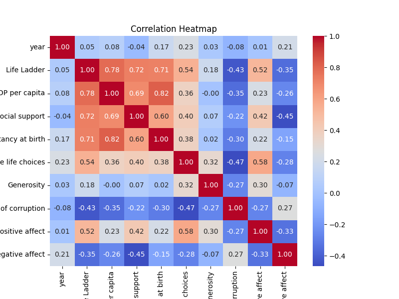
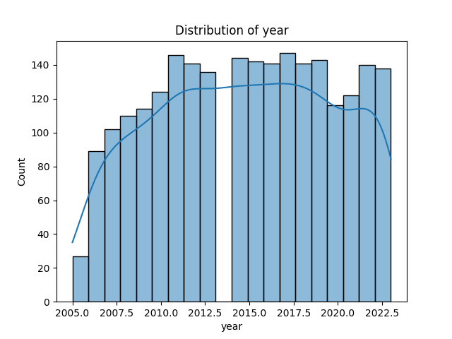
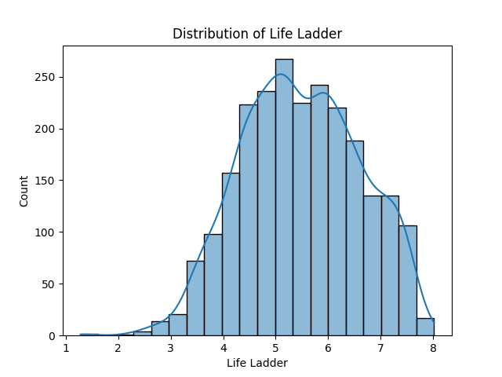
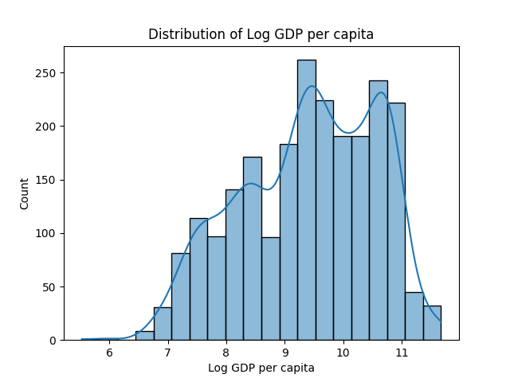
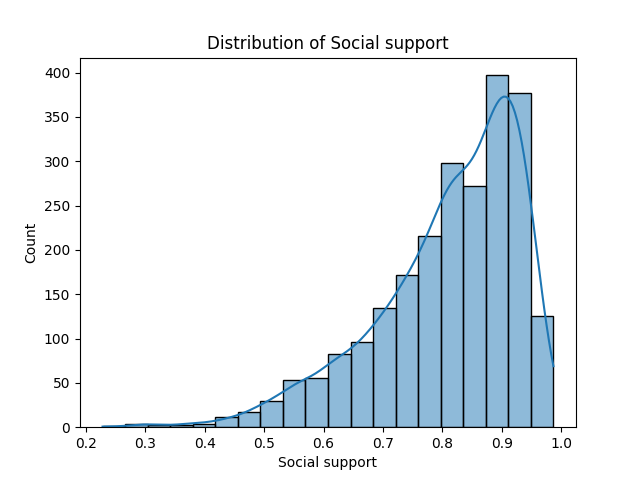
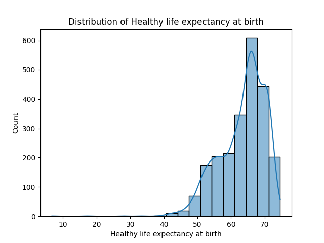
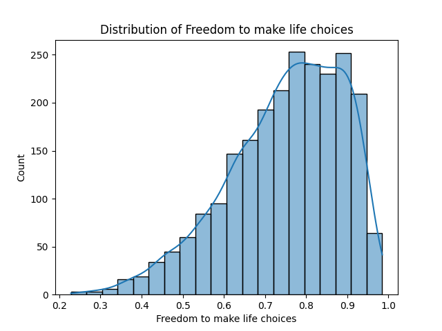
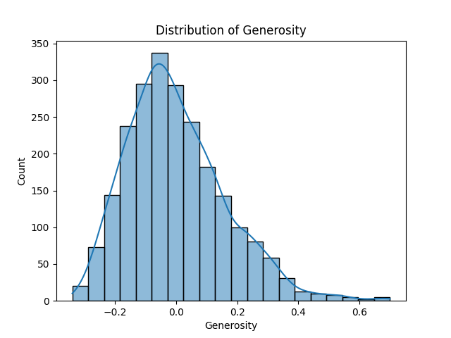
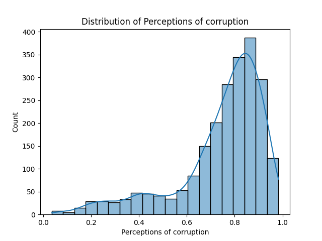
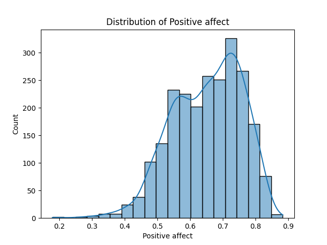
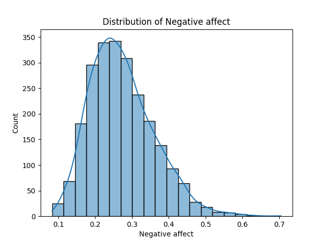
