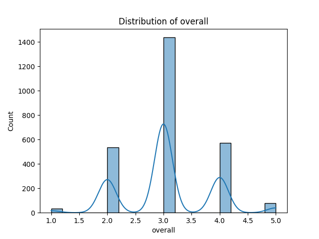
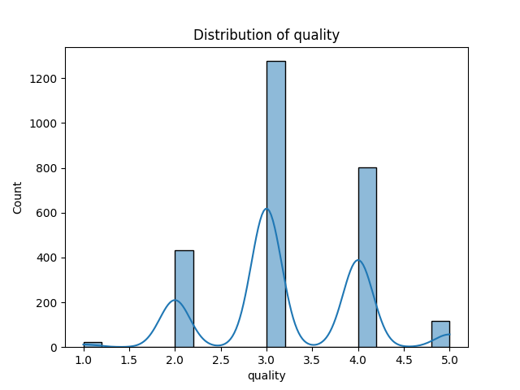
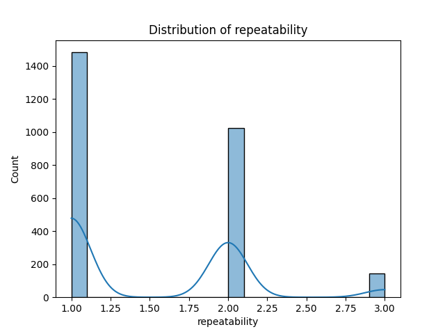

# Automated Analysis Report

## Data Summary

|        | date      | language   | type   | title             | by                |    overall |     quality |   repeatability |
|:-------|:----------|:-----------|:-------|:------------------|:------------------|-----------:|------------:|----------------:|
| count  | 2553      | 2652       | 2652   | 2652              | 2390              | 2652       | 2652        |     2652        |
| unique | 2055      | 11         | 8      | 2312              | 1528              |  nan       |  nan        |      nan        |
| top    | 21-May-06 | English    | movie  | Kanda Naal Mudhal | Kiefer Sutherland |  nan       |  nan        |      nan        |
| freq   | 8         | 1306       | 2211   | 9                 | 48                |  nan       |  nan        |      nan        |
| mean   | nan       | nan        | nan    | nan               | nan               |    3.04751 |    3.20928  |        1.49472  |
| std    | nan       | nan        | nan    | nan               | nan               |    0.76218 |    0.796743 |        0.598289 |
| min    | nan       | nan        | nan    | nan               | nan               |    1       |    1        |        1        |
| 25%    | nan       | nan        | nan    | nan               | nan               |    3       |    3        |        1        |
| 50%    | nan       | nan        | nan    | nan               | nan               |    3       |    3        |        1        |
| 75%    | nan       | nan        | nan    | nan               | nan               |    3       |    4        |        2        |
| max    | nan       | nan        | nan    | nan               | nan               |    5       |    5        |        3        |

## Missing Values

|               |   0 |
|:--------------|----:|
| date          |  99 |
| language      |   0 |
| type          |   0 |
| title         |   0 |
| by            | 262 |
| overall       |   0 |
| quality       |   0 |
| repeatability |   0 |

## Insights from LLM

Error in LLM interaction: 400 Client Error: Bad Request for url: https://aiproxy.sanand.workers.dev/openai/v1/chat/completions

## Visualizations

